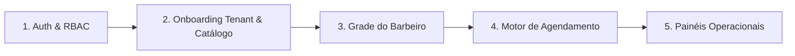

# 💈 Navalhex — Plataforma SaaS Multi-Tenant para Barbearias

> Sistema moderno de gestão e agendamento online multi-serviços para barbearias, com controle rigoroso de concorrência e jornada de profissionais.

---

## 📌 Contexto do Projeto

O **Navalhex** nasceu para solucionar um dos maiores gargalos operacionais no segmento de beleza e barbearias: **choques de horários e atritos no agendamento de múltiplos serviços**. 

A plataforma adota um modelo **Multi-Tenant**, permitindo que cada barbearia cadastrada possua seu próprio espaço com link público personalizado (`/{slug}`), catálogo de serviços, gestão de equipe de barbeiros e regras de jornada de trabalho independentes.

---

## 🎯 Proposta de Valor & Diferenciais

* **Multi-Serviços Inteligente:** O cliente pode selecionar mais de um serviço na mesma sessão (ex: *Corte de Cabelo + Barba + Hidratação*). O sistema soma os valores e durações e encontra slots contínuos disponíveis automaticamente.
* **Motor de Disponibilidade Preciso:** Cruza a grade semanal do barbeiro, intervalos de almoço e agendamentos existentes no dia, garantindo reservas atômicas e eliminando riscos de sobreposição (*overbooking*).
* **Experiência Pública Ágil (`/{slug}`):** Catálogo acessível sem login prévio; a autenticação é solicitada apenas no momento de confirmação da reserva.
* **Painéis Operacionais Especializados:** Visão diária de atendimentos para os barbeiros e autoatendimento com cancelamento antecipado para os clientes.

---

## 🚀 Escopo do MVP (Fase 1)

O MVP foi priorizado com foco no **core de valor** da plataforma:



1. **Gestão de Acesso Básica (Auth & RBAC):** Autenticação via e-mail e senha com JWT e papéis definidos (`ADMIN`, `TENANT`, `BARBER`, `CUSTOMER`).
2. **Onboarding & Catálogo (`tenants` / `services`):** Cadastro do estabelecimento com slug único, dados básicos e catálogo com preço e duração.
3. **Equipe & Jornada (`professionals` / `work_schedules`):** Vínculo de quais serviços cada barbeiro executa e parametrização de jornada semanal.
4. **Agendamento Atômico (`appointments`):** Cálculo dinâmico de disponibilidade e reserva com proteção de concorrência.
5. **Painéis de Gestão:** Visão da agenda do dia para o barbeiro e histórico com cancelamento para o cliente.

---

## 🛠️ Stack Tecnológica

### Backend
* **Linguagem & Plataforma:** Java 21 (LTS)
* **Framework:** Spring Boot (Web, Security, Data JPA, Validation)
* **Banco de Dados:** PostgreSQL 16 Alpine
* **Versionamento de Banco:** Flyway Migrations
* **Produtividade:** Project Lombok
* **Containers:** Docker & Docker Compose
* **Arquitetura:** Monólito Modular (*Package-by-Feature*)

---

## 📂 Estrutura do Projeto

```text
navalhex/
├── .agents/                    # Regras e configurações de pair programming
├── docs/                       # Documentação técnica e de produto
│   ├── diario_de_bordo.md      # Histórico diário de decisões e progresso
│   ├── mvp_tasks.md            # Tarefas técnicas detalhadas (Sub-tasks)
│   ├── mvp_backlog.md          # Backlog INVEST do MVP
│   ├── design_system.md        # Tokens visuais e design system
│   └── guia_user_stories_e_tasks.md
└── backend/                    # API Spring Boot
    ├── docker-compose.yml      # Container do PostgreSQL local
    ├── pom.xml                 # Gerenciamento de dependências Maven
    └── src/
        ├── main/
        │   ├── java/br/com/navalhex/
        │   │   ├── BackendApplication.java
        │   │   └── modules/
        │   │       └── user/   # Módulo de Usuários e Autenticação
        │   │           ├── entity/
        │   │           └── repository/
        │   └── resources/
        │       ├── application.properties
        │       └── db/migration/   # Scripts versionados Flyway
        └── test/
```

---

## ⚙️ Como Executar Localmente

### Pré-requisitos
* [Docker Desktop](https://www.docker.com/) instalado e rodando.
* [Java 21 (JDK)](https://adoptium.net/) instalado.
* Git.

### 1. Clonar o Repositório
```bash
git clone https://github.com/LouisLuos/navalhex.git
cd navalhex
```

### 2. Iniciar o Banco de Dados (PostgreSQL)
```bash
cd backend
docker compose up -d
```

### 3. Executar o Backend (Spring Boot)
No diretório `backend`:
```bash
# Windows
.\mvnw.cmd spring-boot:run

# Linux / Mac
./mvnw spring-boot:run
```
O Flyway executará automaticamente as migrações no banco local e a API estará pronta na porta `8080`.

---

## 📚 Documentação Complementar

* [Diário de Bordo](file:///c:/Users/luizc/Documents/navalhex/docs/diario_de_bordo.md) — Registro diário de evolução e decisões arquiteturais.
* [Detalhamento de Tarefas Técnicas (MVP)](file:///c:/Users/luizc/Documents/navalhex/docs/mvp_tasks.md) — Quebra das histórias em sub-tasks.
* [Backlog INVEST do MVP](file:///c:/Users/luizc/Documents/navalhex/docs/mvp_backlog.md) — Histórias e critérios de aceite.
* [Design System](file:///c:/Users/luizc/Documents/navalhex/docs/design_system.md) — Guia de interface e paleta de cores.
